## [IOS XE Programmability Lab](https://github.com/jeremycohoe/cisco-ios-xe-programmability-lab)


# Module: Model Driven Telemetry

# Docker container: tig_mdt

The tig_mdt docker container from Dockerhub at [https://hub.docker.com/r/jeremycohoe/tig_mdt](https://hub.docker.com/r/jeremycohoe/tig_mdt) is available which has been pre-configured for the Model Driven Telemetry usecases described in this section

Start the container with the following Docker commands:

```
docker pull jeremycohoe/tig_mdt

docker run -ti -p 3000:3000 -p 57500:57500 jeremycohoe/tig_mdt

```

Port **3000** is the Grafana HTTP interface and port **57500 and 57501** have been configured for the gRPC Dial-Out + TLS use cases.


# Grafana Dashboards

There is an example Grafana dashboard available at  [https://grafana.com/grafana/dashboards/13462](https://grafana.com/grafana/dashboards/13462) which can be imported into an existing Grafana deployment. Following the details and instructions on the Grafana.com site as needed to replicate this setup.

The example dashboard looks similar to the below:


# Model-Driven Telemetry

Network data collection for today's high-density platforms and scale is becoming a tedious task for monitoring and troubleshooting. There is a need for operational data from different devices in the network to be collected in a centralized location, so that cross-functional groups can collaboratively work to analyze and fix an issue.

**Model-driven Telemetry** (MDT) provides a mechanism to stream data from an MDT-capable device to a destination. It uses a new approach for network monitoring in which data is streamed from network devices continuously using a push model and provides near real-time access to operational statistics for monitoring data. Applications can subscribe to specific data items they need, by using standards-based YANG data models over open protocols. Structured data is published at a defined cadence or on-change, based upon the subscription criteria and data type.

There are two main MDT Publication/Subscription models, Dial-in and Dial-out:

**Dial-in** is a dynamic model. An application based on this model has to open a session to the network device and send one or more subscriptions reusing the same session. The network device will send the publications to the application for as long as the session stays up. **NETCONF** and **gNMI** are the Dial-In telemetry interfaces. 

**Dial-out** is a configured model. The subscriptions need to be statically configured on the network device using any of the available interfaces (CLI, APIs, etc.) and the device will open a session with the application. If the session goes down, the device will try to open a new session. **gRPC** is the Dial-Out telemetry interface.

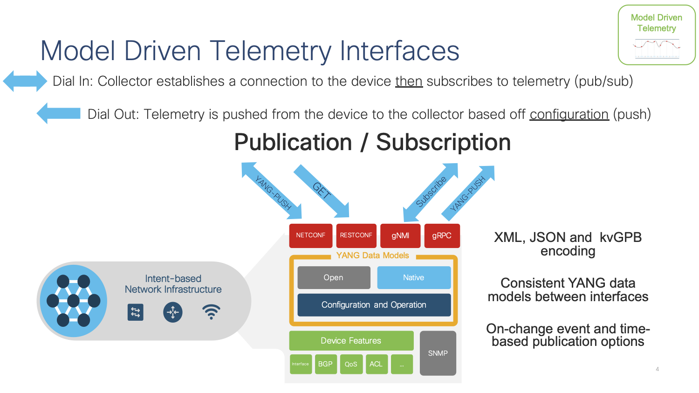

In this lab we cover the **gRPC Dial-out** telemetry that was released in IOS XE 16.10 along with the open source software stack for collection and visualization:

- **Telegraf (Collection)** with the **cisco\_telemetry\_mdt** plugin that decodes the gRPC data to text
- **InfluxDB (Storage)**: an open-source time series database optimized for fast, high-availability storage and retrieval of time series data in fields such as operations monitoring, application metrics, Internet of Things sensor data, and real-time analytics. It provides a SQL-like language with built-in time functions for querying a data structure composed of measurements, series, and points
- **Grafana (GUI visualization)**: an open-source platform to build monitoring and analytics dashboards

Every LAB POD includes a full installation of all the above-mentioned software.

### Step 1 - Setup our TIG stack

First thing we need to do is configure our TIG stack on our local machine. Thankfully, Jeremy Cohoe has created a fantastic docker container with all the needed components preinstalled. You can pull the container from the Docker hub with the following shell command.

```docker pull jeremycohoe/tig_mdt```

Let that pull down the required image from Docker hub then run the following command to start the container. 

```docker run -ti -p 3000:3000 -p 57500:57500 jeremycohoe/tig_mdt```

## NETCONF Dial-In Model Driven Telemetry

The NETCONF Model Driven Telemetry interface needs only to be enabled within IOS XE - once enabled the Dial-In **(dynamic)** connection can be established from the tooling. 

To enable the NETCONF use the following CLI. Refer to the **NETCONF** module for more details.

```
netconf-yang
```

The AAA requirements for NETCONF are for the user to have privilege level 15 upon login which can be acheived using either local or RADIUS based authentication as shown below:

```
configure terminal
aaa new-model
aaa authentication login default local
aaa authorization exec default local 
aaa session-id common

username admin privilege 15 password 0 Cisco123
```

The **netconf-console** and **ncc-establish-subscription.py** tooling can be used to create dynamic Dial-In telemetry subscriptions from the command line. This is useful when initially building telemetry subscriptions to gain a better understanding of the actual data payload that is send from the IOS XE device.

Enter the python3 virtual envrionment with the 3 linux commands:

```
cd ; cd ncc

virtualenv v

source v/bin/activate

cd ncc

./ncc-establish-subscription.py --host 10.1.1.5 -u admin -p Cisco123 --period 1000 --xpath '/interfaces/interface'
```

The **ncc-establish-subscription.py** tool is used to collect the /interfaces/interface data every 1000 centiseconds (10 seconds) as shown below. Press **CTRL+C** to stop the script.

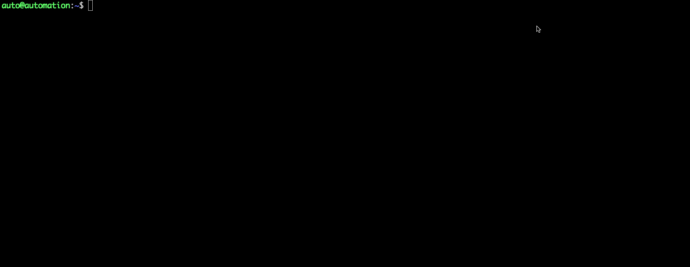

The example payload is listed here:

```
auto@automation:~/ncc$ python2 ./ncc-establish-subscription.py --host 10.1.1.5 -u admin -p Cisco123 --period 1000 --xpath '/interfaces/interface'
Subscription Result : notif-bis:ok
Subscription Id     : 2147483660
-->>
(Default Callback)
Event time      : 2020-06-25 02:40:22.050000+00:00
Subscription Id : 2147483660
Type            : 1
Data            :
<datastore-contents-xml xmlns="urn:ietf:params:xml:ns:yang:ietf-yang-push">
  <interfaces xmlns="http://cisco.com/ns/yang/Cisco-IOS-XE-interfaces-oper">
    <interface>
      <name>AppGigabitEthernet1/0/1</name>
      <interface-type>iana-iftype-ethernet-csmacd</interface-type>
      <admin-status>if-state-up</admin-status>
      <oper-status>if-oper-state-ready</oper-status>
      <last-change>2020-06-12T05:08:25.371000+00:00</last-change>
      <if-index>49</if-index>
      <phys-address>CC:5A:53:D9:24:29</phys-address>
      <speed>1024000000</speed>
      <statistics>
        <discontinuity-time>2020-06-12T05:04:40+00:00</discontinuity-time>
        <in-octets>24268</in-octets>
        <in-unicast-pkts>-324</in-unicast-pkts>
        <in-broadcast-pkts>324</in-broadcast-pkts>
        <in-multicast-pkts>324</in-multicast-pkts>
        <in-discards>0</in-discards>
        <in-errors>0</in-errors>
        <in-unknown-protos>0</in-unknown-protos>
        <out-octets>92342210</out-octets>
        <out-unicast-pkts>1284357</out-unicast-pkts>
        <out-broadcast-pkts>40</out-broadcast-pkts>
        <out-multicast-pkts>0</out-multicast-pkts>
        <out-discards>0</out-discards>
        <out-errors>0</out-errors>
        <rx-pps>0</rx-pps>
        <rx-kbps>0</rx-kbps>
        <tx-pps>1</tx-pps>
        <tx-kbps>0</tx-kbps>
        <num-flaps>0</num-flaps>
        <in-crc-errors>0</in-crc-errors>
        <in-discards-64>0</in-discards-64>
        <in-errors-64>0</in-errors-64>
        <in-unknown-protos-64>0</in-unknown-protos-64>
        <out-octets-64>92342210</out-octets-64>
      </statistics>
<SNIP ... lots more below !>
```


This concludes NETCONF Dial-In telemetry with CLI tooling - it will be explored further with the Telegraf, InfluxDB, and Grafana tooling in another section.

## gNMI Dial-In Model Driven Telemetry

To enable the gNMI Dial-In Model Driven Telemetry interface use the following CLI's. Refer to the **gNMI** module for more details.

Version <17.3

```
gnmi-yang
gnmi-yang server
```

Version 17.3+
```
gnxi
gnxi server
```


NOTE: This enables gNMI only in insecure mode. The CLI **gnmi-yang secure-server (<v17.3) or gnxi secure-server (v17.3+)** enables the gNMI server in secure mode and requires TLS certificates to be loaded into IOS XE first. Refer to the **gNMI Module** for details on this configuration. The gNMI insecure server may used in the following examples.

Use the **gnmi_cli** tool to create a subscription with the following flags. Refer to the **gNMI Module** for details on certificate creation using the gen_certs.sh script if needed.

```
gnmi_cli -address 10.1.1.5:9339 -server_name c9300 -with_user_pass -timeout 5s -ca_crt rootCA.pem -client_crt client.crt -client_key client.key -proto "$(cat ~/gnmi_proto/sub_vlan1.txt)" -dt p
```

### Example: Subscribe to Access Point Oper Data

With wireless, receive telemetry data from Access Points (APs) using YANG Suite and a device running IOS XE 17.7:

In this example, we collect the radio-oper-data and the phy-ht-cfg:
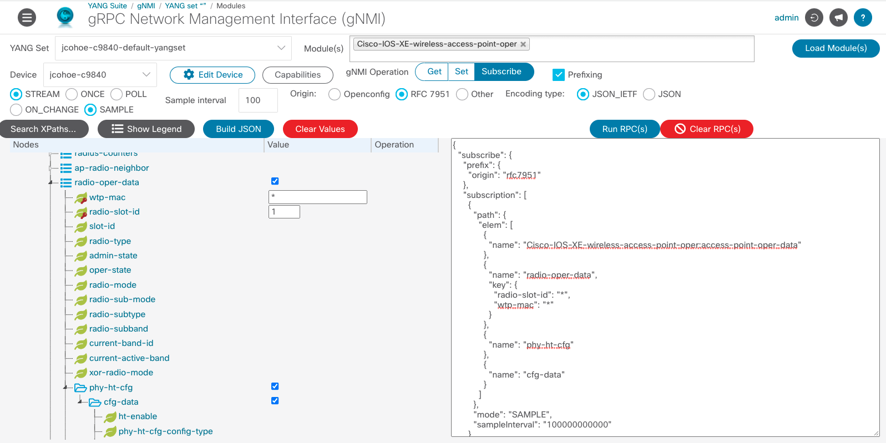

1. Within YANG Suite, navigate to "Protocols" > "gNMI".
1. Select the YANG Set for the wireless device
1. Select the "Cisco-IOS-XE-wireless-access-point-oper" Module
1. Click the blue "Load Module(s)" button
1. Select the device
1. For the gNMI Operation, select "Subscribe"
1. Click the checkbox next to "Prefixing"
1. Select "STREAM"
1. Select "SAMPLE"
1. Choose a sample interval
1. Select "RFC 7951" as the Origin
1. Select the Encoding type "JSON_IETF"
1. Once loaded, expand the tree to select the specific features to receive telemetry on the APs
1. Click the blue "Build JSON" button
1. Click the blue "Run PRC(s)" button
1. In a new window, the subscription data will appear
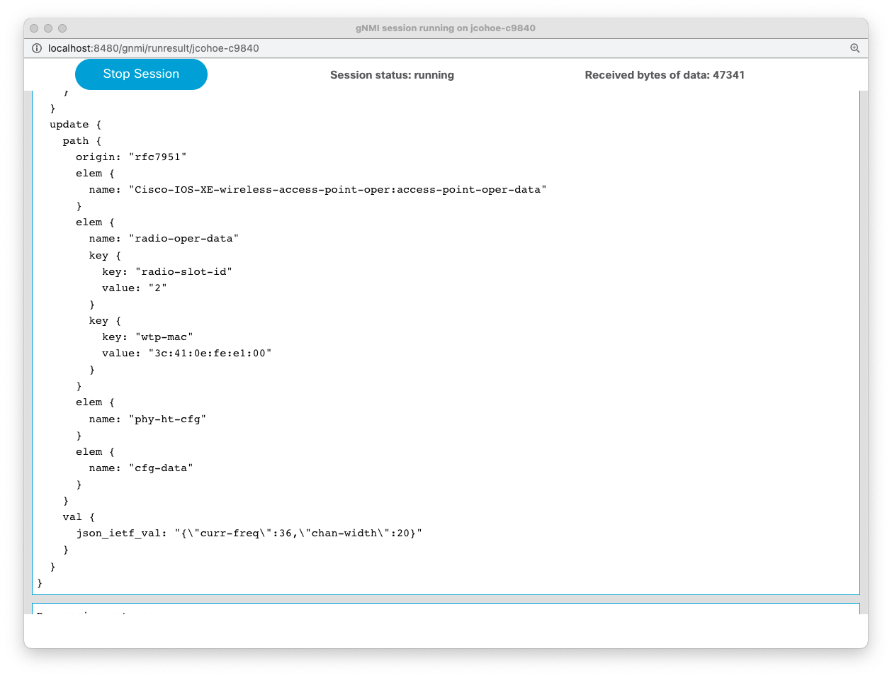

gNMI Subscription:
```
gNMI SUBSCRIBE
==============
subscribe {
  prefix {
    origin: "rfc7951"
  }
  subscription {
    path {
      elem {
        name: "Cisco-IOS-XE-wireless-access-point-oper:access-point-oper-data"
      }
      elem {
        name: "radio-oper-data"
      }
    }
    mode: SAMPLE
    sample_interval: 100000000000
  }
  encoding: JSON_IETF
}
```

gNMI Update:
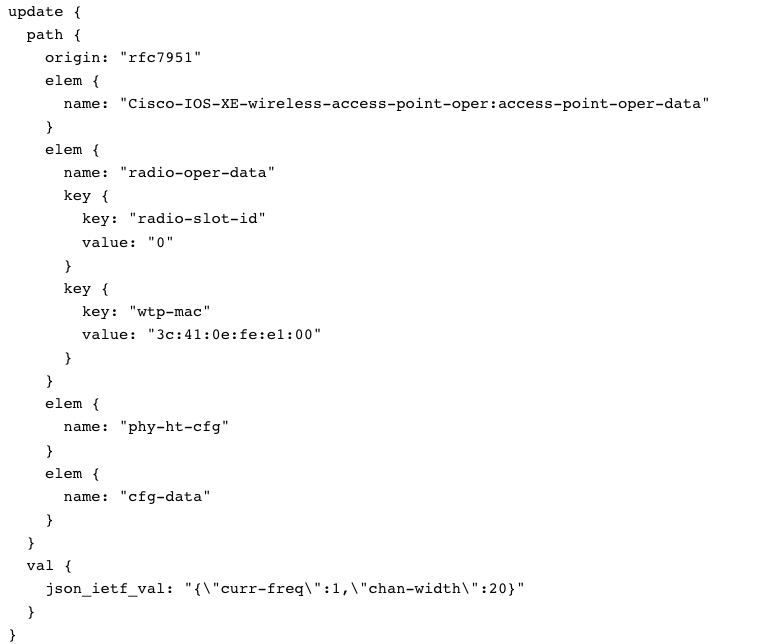


### Example: Subscribe to Interfaces

The **sub_vlan1.txt** defines the parameters for the subscription for the openconfig-interfaces (oc-if) interfaces/interface Vlan1 data. Copy and paste the contents into the **~/gnmi_proto/sub_vlan1.txt** file:

```
subscribe: <
    prefix: <>
    subscription: <
      path: <
            origin: "legacy"
            elem: <
                name: "oc-if:interfaces"
            >
            elem: <
                name: "interface"
                key {
                    key: "name"
                    value: "Vlan1"
            }
        >
        >
        mode: SAMPLE
        sample_interval: 10000000000
    >
    mode: STREAM
    encoding: JSON_IETF
>
```

Details of the **openconfig-interfaces.YANG** data model are availble from the **YANGSuite** GUI in the Explore YANG area:

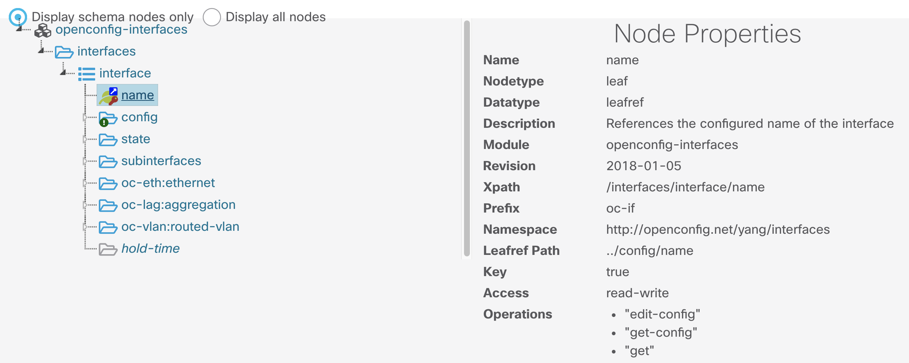

The complete workflow for gnmi_cli with the subscription will look similar to the following:


A complete payload example will look similar to the following:

```
auto@automation:~/gnmi_ssl/certs$ gnmi_cli -address 10.1.1.5:9339 -server_name c9300 -with_user_pass -timeout 5s -ca_crt rootCA.pem -client_crt client.crt -client_key client.key -proto "$(cat ~/gnmi_proto/sub_vlan1.txt)" -dt p
username: admin
password: update: <
  timestamp: 1593052438832704000
  update: <
    path: <
      origin: "legacy"
      elem: <
        name: "oc-if:interfaces"
      >
      elem: <
        name: "interface"
        key: <
          key: "name"
          value: "Vlan1"
        >
      >
    >
    val: <
      json_ietf_val: "{\"name\":\"Vlan1\",\"config\":{\"name\":\"Vlan1\",\"type\":\"l3ipvlan\",\"enabled\":true},\"state\":{\"name\":\"Vlan1\",\"type\":\"l3ipvlan\",\"enabled\":true,\"ifindex\":53,\"admin-status\":\"UP\",\"oper-status\":\"UP\",\"last-change\":\"1590783663156000000\",\"counters\":{\"in-octets\":\"3550\",\"in-unicast-pkts\":\"38\",\"in-broadcast-pkts\":\"0\",\"in-multicast-pkts\":\"0\",\"in-discards\":\"0\",\"in-errors\":\"0\",\"in-unknown-protos\":\"0\",\"in-fcs-errors\":\"0\",\"out-octets\":\"10439\",\"out-unicast-pkts\":\"78\",\"out-broadcast-pkts\":\"0\",\"out-multicast-pkts\":\"0\",\"out-discards\":\"0\",\"out-errors\":\"0\",\"last-clear\":\"1590783517000000000\"},\"openconfig-platform-port:hardware-port\":\"Vlan1\"}}"
    >
  >
>
```

The relevant key-value pair with the payload showing the interface details is:

```
val: <
      json_ietf_val: "{"name":"Vlan1","config":{"name":"Vlan1","type":"l3ipvlan","enabled":true},
      "state":{"name":"Vlan1","type":"l3ipvlan","enabled":true,"ifindex":53,"admin-status":"UP",
      "oper-status":"UP","last-change":"1590783663156000000","counters":{"in-octets":"3550","in-unicast-pkts":"38",
      "in-broadcast-pkts":"0","in-multicast-pkts":"0","in-discards":"0","in-errors":"0","in-unknown-protos":"0",
      "in-fcs-errors":"0","out-octets":"10439","out-unicast-pkts":"78","out-broadcast-pkts":"0","out-multicast-pkts":"0",
      "out-discards":"0","out-errors":"0","last-clear":"1590783517000000000"},"openconfig-platform-port:hardware-port":"Vlan1"}}"
```

This concludes the **gnmi_cli** tooling example. The **Telegraf** tooling can also be used to collect the telemtry data and save it into the InfluxDB time-series database, where Grafana will be used to visualize the metrics data. This will be explored in the next section.

# gRPC Dial-Out Configured Subscriptions

Lets continue by checking the subscriptions configured on the Catalyst 9300.

Step 1. Open a SSH connection to the Catalyst 9300 switch

Step 2. Check the subscription configured on the device using the following IOS XE CLI

**C9300# show run | sec telemetry**

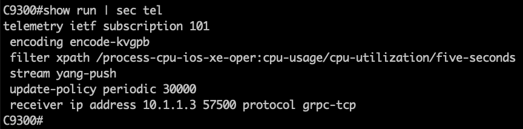

Lets analyze the main parts of the subscription configuration:

- telemetry ietf subscription 101 (subscription ID)
- encoding encode-kvgpb (Key-Value pair encoding)
- filter xpath /process-cpu-ios-xe-oper:cpu-usage/cpu-utilization/five-seconds (xpath)
- update-policy periodic 500 (period in 1/100 seconds, 5 secs here)
- receiver ip address 10.1.1.3 57500 protocol grpc-tcp (receivers IP, port and protocol)

This telemetry configuration has already been applied to the switch. However, if it needs to be re-applied the following can be used to easily copy/paste:

```
conf t
telemetry ietf subscription 101
encoding encode-kvgpb
filter xpath /process-cpu-ios-xe-oper:cpu-usage/cpu-utilization/five-seconds
source-address 10.1.1.5
stream yang-push
update-policy periodic 500
receiver ip address 10.1.1.3 57500 protocol grpc-tcp

```

Step 3. Verify the configured subscription using the following **telemetry** IOS XE CLIs

**c9300# sh telemetry ietf subscription all**

```

Telemetry subscription brief

ID               Type        State       Filter type
-----------------------------------------------------
101              Configured  Valid       xpath

```


**c9300# sh telemetry ietf subscription 101 detail**

```
Telemetry subscription detail:

Subscription ID: 101
Type: Configured
State: Valid
Stream: yang-push
Filter:
Filter type: xpath
XPath: /process-cpu-ios-xe-oper:cpu-usage/cpu-utilization/five-seconds
Update policy:
Update Trigger: periodic
Period: 500
Encoding: encode-kvgpb
Source VRF:
Source Address: 10.1.1.5
Notes:

Receivers:
Address          Port             Protocol         Protocol Profil
------------------------------------------------------------------
10.1.1.3         57500            grpc-tcp

```

**c9300# sh telemetry ietf subscription 101 receiver**

```
Telemetry subscription receivers detail:

Subscription ID: 101
Address: 10.1.1.3
Port: 57500
Protocol: grpc-tcp
Profile:
State: Connected
Explanation:
```


The State should report **Connected**.

If that state does not show Connected, for example, if it is the  "Connecting " state, then simple remove and re-add the telemetry configuration before continuing with the next steps and troubleshooting:

```
conf t
no telemetry ietf subscription 101
telemetry ietf subscription 101
encoding encode-kvgpb
filter xpath /process-cpu-ios-xe-oper:cpu-usage/cpu-utilization/five-seconds
source-address 10.1.1.5
stream yang-push
update-policy periodic 500
receiver ip address 10.1.1.3 57500 protocol grpc-tcp
```

Note: If the state does not show  "Connected" then ensure the Docker container with the Telegraf receiver is running correctly. Follow the next steps to confirm status of each component.


## Telegraf, Influx, Grafana (TIG)

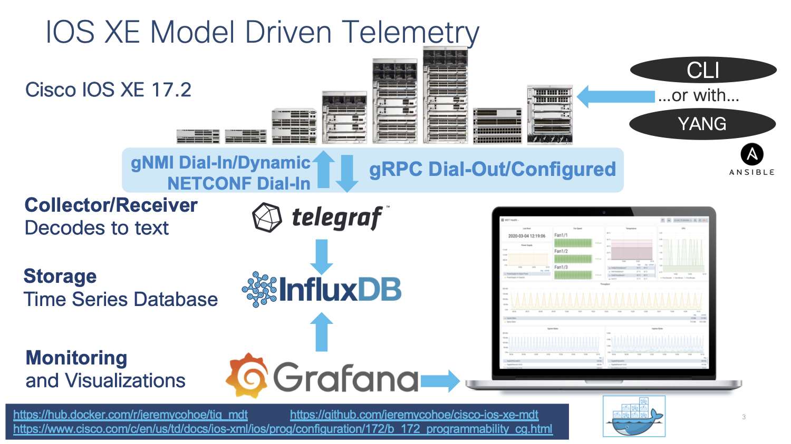

Telegraf is the tool that receives and decodes the telemetry data that is sent from the IOS XE devices. It processes the data and sends it into the InfluxDB datastore, where Grafana can access it in order to create visualizations.

Telegraf runs inside the  "tig_mdt" Docker container. To connect to this container from the Ubuntu host follow the steps below:

```
auto@automation:~$ docker ps
```

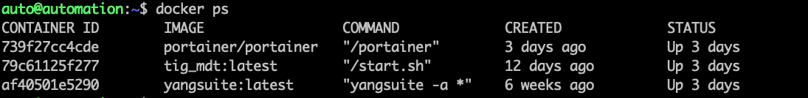

```
auto@automation:~$ docker exec -it tig_mdt /bin/bash

 <You are now within the Docker container>

# cd /root/telegraf
# ls
```

There is one file for each telemetry interface: **NETCONF**, **gRPC**, and **gNMI**. Review each file to understand which. YANG data is being collected by which interface.

```
# cat telegraf-grpc.conf
# cat telegraf-gnmi.conf
# cat telegraf-netconf.conf
```

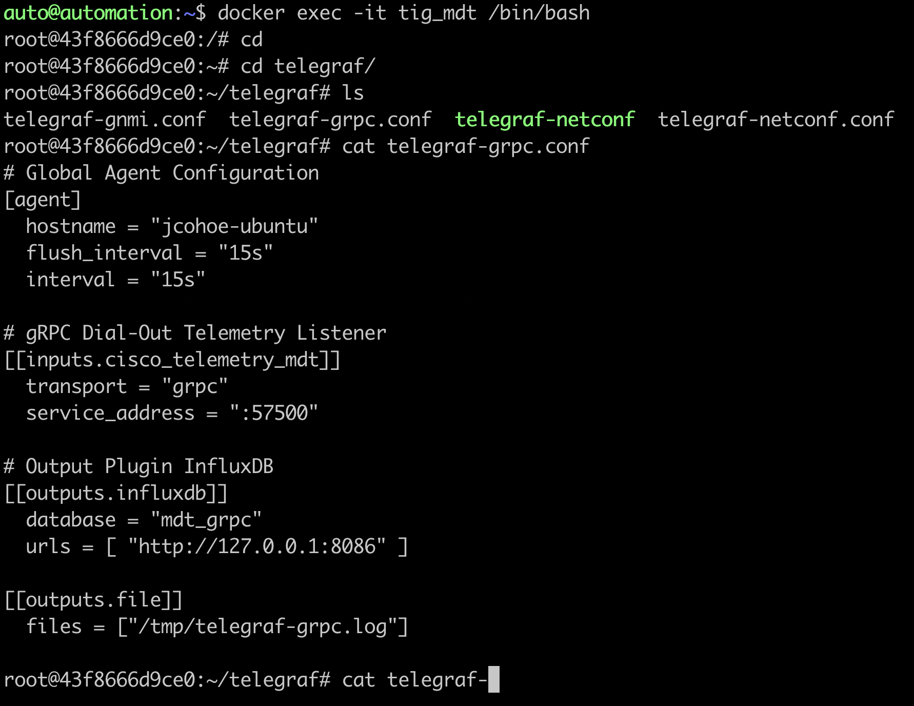

Inside the Docker container navigate to the telegraf directory and review the configuration file and log by tailing the log file with the command **tail -F /tmp/telegraf-grpc.log** 

The **telegraf-grpc.conf** configuration file shows us the following:

**gRPC Dial-Out Telemetry Input:** This defines the telegraf plugin (cisco\_telemetry\_mdt) that is being used to receive the data, as well as the port (57500)

**Output Plugin:** This defines where the received data is sent to (outputs.influxdb) the database to use (telegraf) and the URL for InfluxDB ([http://127.0.0.1:8086](http://127.0.0.1:8086/))

**Outputs.file** : sends a copy of the data to the text file at /root/telegraf/telegraf.log

These configuration options are defined as per the README file in each of the respective input or output plugins. For more details of the cisco_telemetry_mdt plugin that is in use here, see the page at ["https://github.com/influxdata/telegraf/tree/master/plugins/inputs/cisco_telemetry_mdt"]("https://github.com/influxdata/telegraf/tree/master/plugins/inputs/cisco_telemetry_mdt")

Examining the output of the telegraf.log file shows the data coming in from the IOS XE device that matches the subscription we created and do ctrl+c to stop the output

**# tail -F /tmp/telegraf.log**

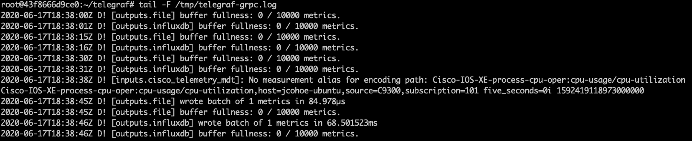

## The Influx Database (influxdb)


InfluxDB is already installed and started within the same Docker container. Lets verify it s working correctly by connecting into the Docker contain where it is running.

Step 1. Verify InfluxDB is running with the command **ps xa | grep influx**

```
15 pts/0 Sl+ 1:45 /usr/bin/influxd -pidfile /var/run/influxdb/influxd.pid -config /etc/influxdb/influxdb.conf
```

Step 2. Verify the data stored on the Influx database using the command shown below:

```
root@43f8666d9ce0:~# influx
Connected to http://localhost:8086 version 1.7.7
InfluxDB shell version: 1.7.7
> show databases
name: databases
name
----
_internal
mdt_gnmi
mdt_grpc
cisco_mdt
mdt_netconf
>
> drop database cisco_mdt
> quit
root@43f8666d9ce0:~#
root@43f8666d9ce0:~#
root@43f8666d9ce0:~#
root@43f8666d9ce0:~#
root@43f8666d9ce0:~#
root@43f8666d9ce0:~#
root@43f8666d9ce0:~# influx
Connected to http://localhost:8086 version 1.7.7
InfluxDB shell version: 1.7.7
>
> show databases
name: databases
name
----
_internal
mdt_gnmi
mdt_grpc
mdt_netconf
>
> use mdt_grpc
Using database mdt_grpc
> show measurements
name: measurements
name
----
Cisco-IOS-XE-process-cpu-oper:cpu-usage/cpu-utilization
>
> SELECT COUNT("five_seconds") FROM "Cisco-IOS-XE-process-cpu-oper:cpu-usage/cpu-utilization"
name: Cisco-IOS-XE-process-cpu-oper:cpu-usage/cpu-utilization
time count
---- -----
0    1134
>
```

The output above shows:

- a **telegraf** dababase as defined in the Telegraf config file which holds that telemetry data
- one measurement defined as the YANG model used for the gRPC Dial-out subscription (Cisco-IOS-XE-process-cpu-oper:cpu-usage/cpu-utilization)
- number of publications received so far (33251).

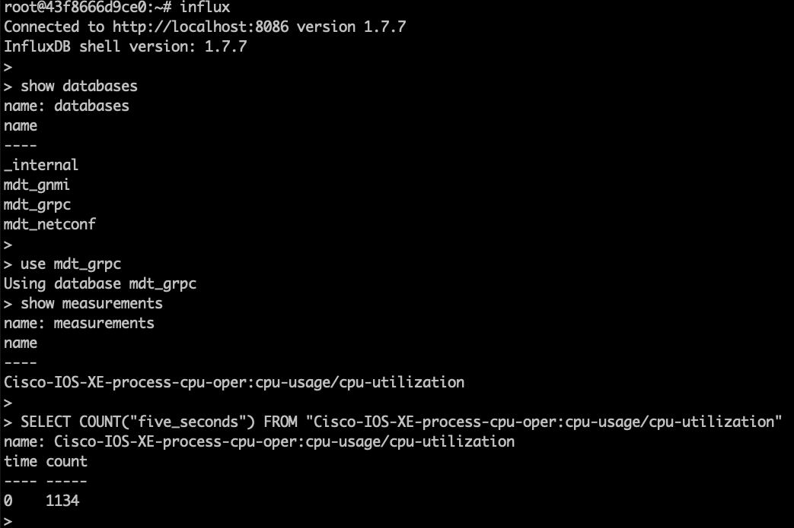

# Grafana Dashboard

Grafana is an open-source platform to build monitoring and analytics dashboards that also runs within the Docker container. Navigating to the web based user interface allows us to see the dashboard with the Model Driven Telemetry data

Verify Grafana is running: with the following command: **ps xa | grep grafana**

```
44 ? Sl 0:32 /usr/sbin/grafana-server --pidfile=/var/run/grafana-server.pid --config=/etc/grafana/grafana.ini --packaging=deb cfg:default.paths.provisioning=/etc/grafana/provisioning cfg:default.paths.data=/var/lib/grafana cfg:default.paths.logs=/var/log/grafan cfg:default.paths.plugins=/var/lib/grafana/plugins**
```

Step 1. Open Firefox or Chrome and access the interface Grafana at [http://10.1.1.3:3000](http://10.1.1.3:3000/)

You should see the following dashboard after logging in with admin:Cisco123

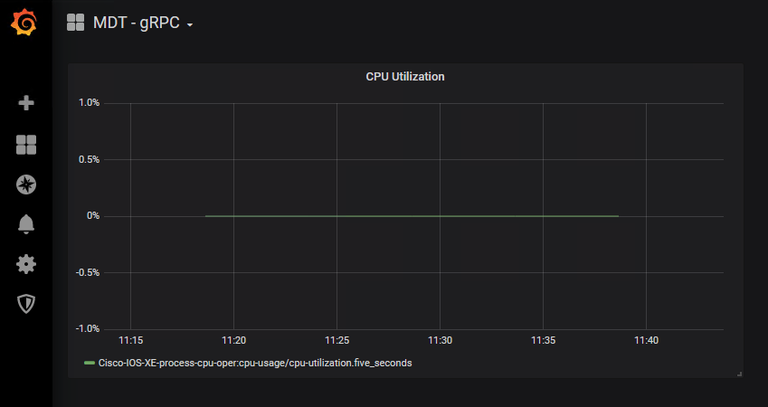

To better understand the Grafana dashboard, lets edit the dashlet to see which data is being displayed:

Step 2. Access the Grafan UI on HTT port 3000
Step 3. Click the **"CPU Utilization"** drop-down and then select **"Edit "**

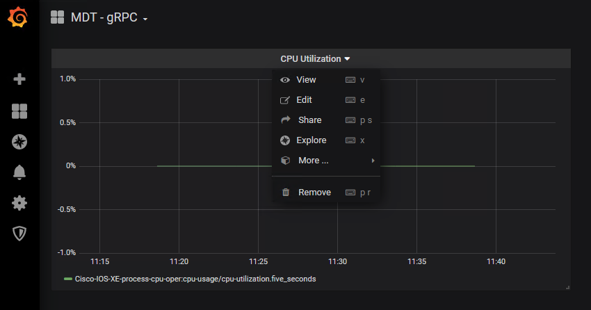

Step 4. Review the information this is pre-configured for this particular chart, specifically the FROM and SELECT sections

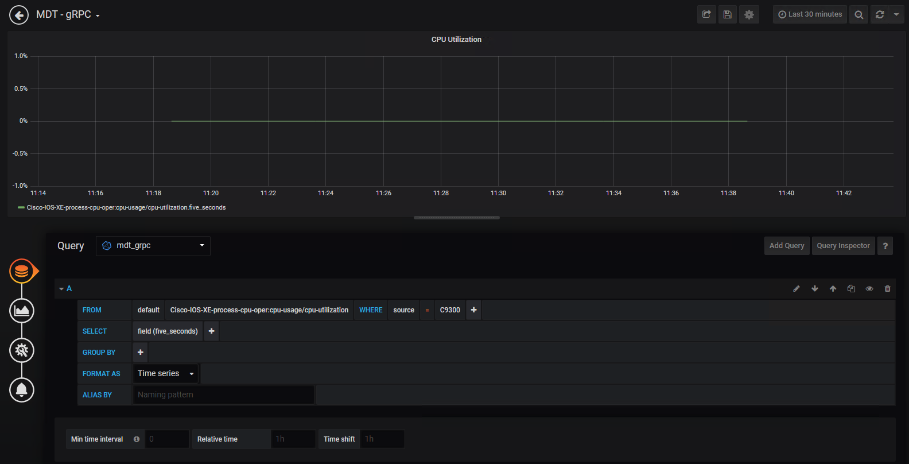

# Conclusion

This module has shown how to configure the gRPC Dial Out configured telemetry feature on IOS XE. Using the Docker container with the open-source Telegraf + InfluxDB + Grafana stack you were able to receive, store, and visualize the telemetry information.
	
